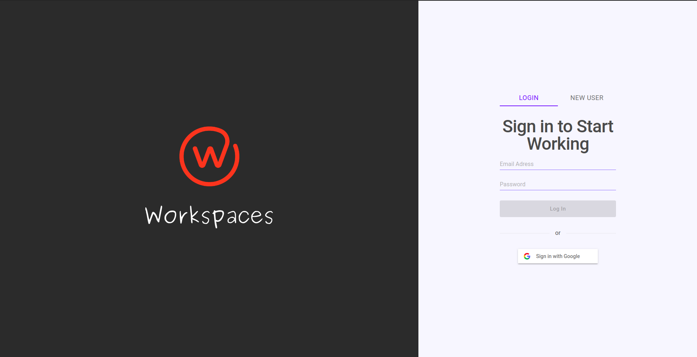
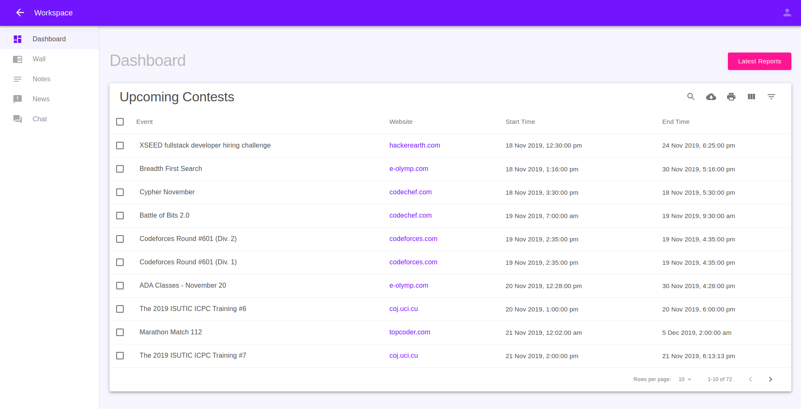
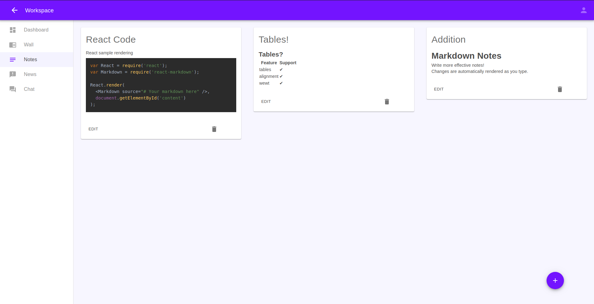
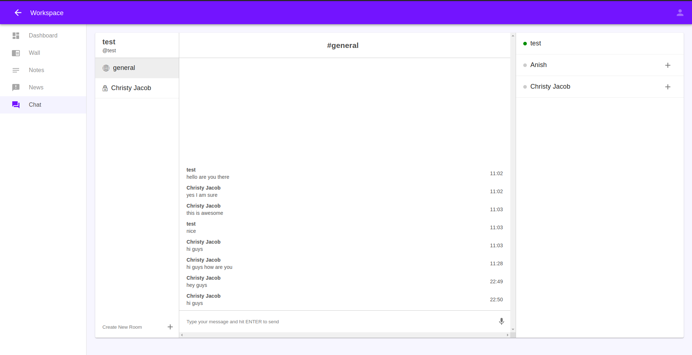
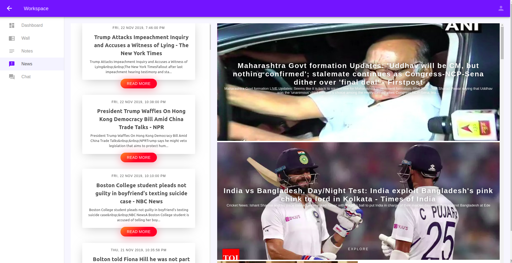

<h1 align="center">Workspaces</h1>
<p align = center>
    
</p>

<p align="center">


  

  <!--  -->

  <a href="https://github.com/christyjacob4/workspaces/blob/master/LICENSE">
    
  </a>

  <a href="https://twitter.com/christyjacob4">
    
  </a>
  

</p>
<h3 align="center">A productivity workspace for programmers, complete with the ability to create and save markdown notes, create chat-rooms and private chats & browse all coding contests</h3>

<h2 align="center">Check out the demo at <a href="https://workspaces.netlify.com/">https://workspaces.netlify.com/</h2>

## Tech Stack
<p align="center">


  
  </p>

<p align="center">
 
  
</p>
<p align="center">


  
</p>

## 🚀 Usage

* ### Clone the repository
```sh
git clone https://github.com/christyjacob4/workspaces
cd workspaces
```

* ### Install dependencies
```sh
npm install 
```

* ### Start developement Server
```sh
npm run start
```

## ✨ Screenshots


<p align="center">
    
</p>
<p align="center">
    
</p>
<p align="center">
    
</p>
<p align="center">
    
</p>
<p align="center">
    
</p>


## 🍻 Contributing

Contributions, issues and feature requests are welcome.<br />
Feel free to check [issues page](https://github.com/christyjacob4/web-tech-docs/issues) if you want to contribute.


## 👤 Author

**Anish M Rao**
- Github: [@anishmrao](https://github.com/anishmrao)

**Christy Jacob**
- Twitter: [@christyjacob4](https://twitter.com/christyjacob4)
- Github: [@christyjacob4](https://github.com/christyjacob4)

**Anmol Garg**
- Github: [@AnmolGarg2002](https://github.com/AnmolGarg2002)

## 🤝 Acknowledgements
- Icons by [Flaticon](https://www.flaticon.com/)


## 🙌 Show your support

Please ⭐️ this repository if this project helped you!

## 📝 License

Copyright © 2019 [Christy Jacob](https://github.com/christyjacob4).<br />
This project is [MIT](https://github.com/christyjacob4/workspaces/blob/master/LICENSE) licensed.

---
